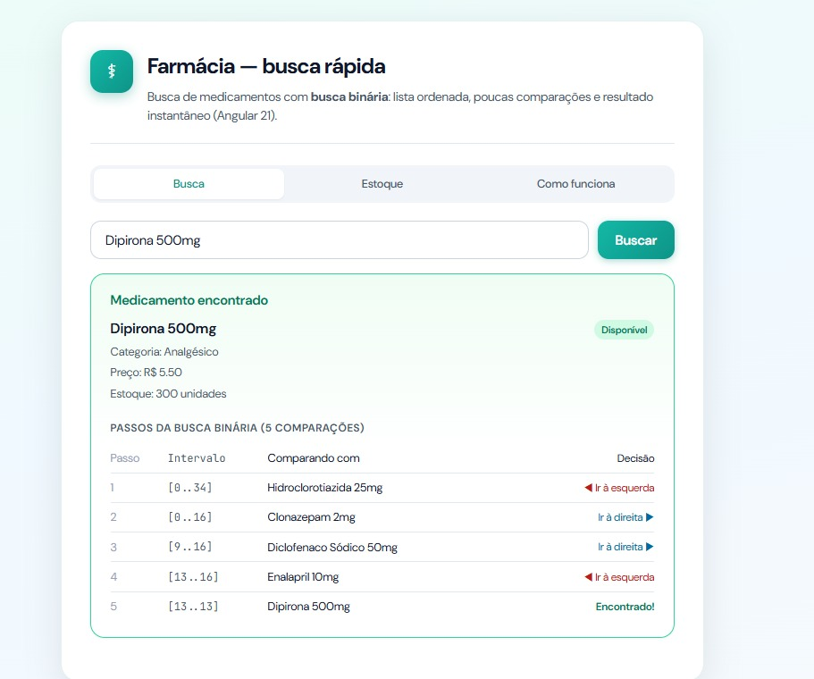
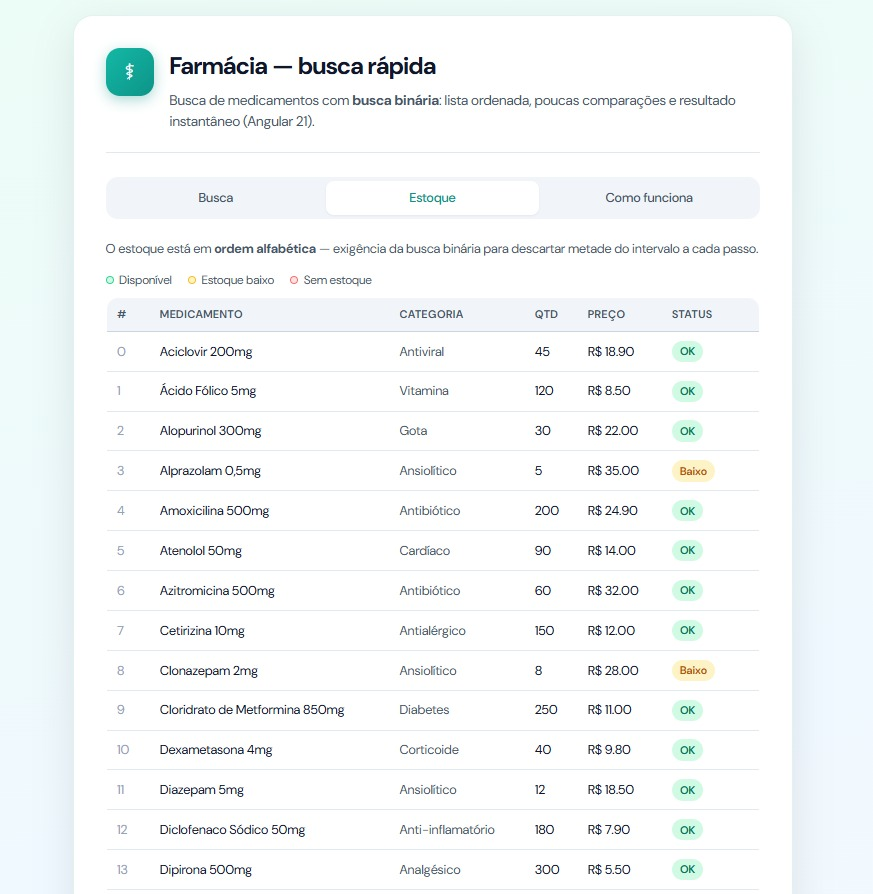
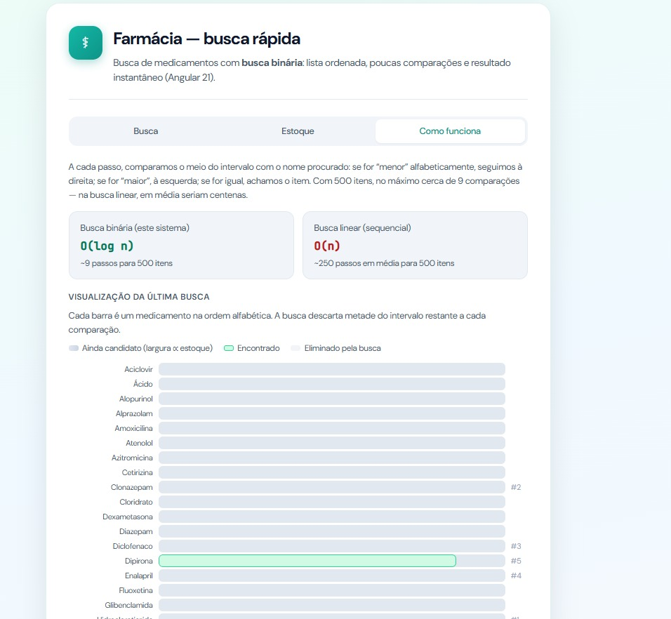

# Busca-Farmácia

**Conteúdo da disciplina:** Métodos de Busca

## Alunos

| Matrícula  | Aluno                                      |
| ---------- | ------------------------------------------ |
| 211030667  | Ana Luíza Fernandes Alves da Rocha         |
| 211041295  | Tales Rodrigues Gonçalves                  |

## Sobre

Este trabalho implementa uma aplicação web para consulta de estoque de medicamentos, com foco na **busca binária** como método de localização por nome. A lista de medicamentos é mantida **ordenada alfabeticamente**, condição necessária para aplicar o algoritmo: a cada iteração compara-se o elemento central ao termo buscado e descarta-se metade do intervalo restante, obtendo complexidade **O(log n)** em relação ao número de itens.

O projeto foi desenvolvido em **Angular** e inclui interface para busca, visualização dos passos do algoritmo e comparação conceitual com busca linear. Quando não há correspondência exata, o sistema pode sugerir nomes parecidos (busca auxiliar por trecho do texto).

## Screenshots







## Vídeo de apresentação

Neste vídeo, apresentamos um resumo completo do trabalho desenvolvido, abordando os principais pontos discutidos ao longo do projeto.

**[Assista no YouTube](https://youtu.be/rocPoe7KyyE?si=X4LA1G7AOvCW5unn)**

## Instalação

### Linguagem e stack

- **TypeScript**
- **Angular** (CLI 21.x)
- Interface: HTML/CSS com componentes Angular

### Pré-requisitos

- [Node.js](https://nodejs.org/) (versão compatível com o Angular 21; recomenda-se LTS recente)
- [npm](https://www.npmjs.com/) (incluso com o Node; o projeto referencia `npm@11.6.4` no `package.json`)

### Como rodar

1. **Clone o repositório**

   ```bash
   git clone https://github.com/eda2-2026/G25_Busca_EDA2_2026.1.git
   ```

2. **Navegue até a pasta principal do projeto**

   ```bash
   cd farmacia-busca-binaria-angular
   ```

3. **Instale as dependências**

   ```bash
   npm install
   ```

4. **Inicie o servidor de desenvolvimento**

   ```bash
   npm start
   ```

   Ou, equivalentemente:

   ```bash
   ng serve
   ```

5. Abra o navegador em **http://localhost:4200/**.


